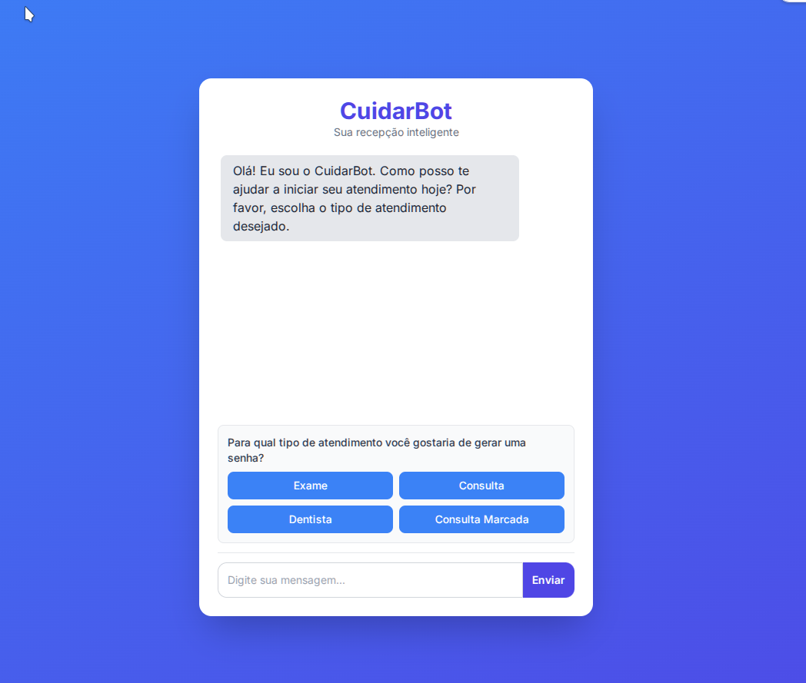
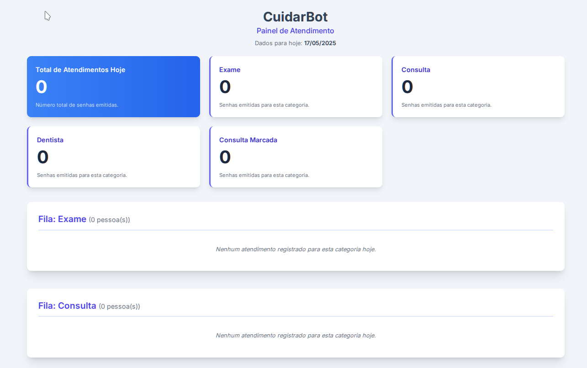

# Versão final do projeto CuidarBot para Imersão IA Alura+Google
# CuidarBot - Recepção Inteligente para Postos de Saúde


## 📝 Descrição do Projeto

O **CuidarBot** é um sistema de recepção inteligente desenvolvido durante a **Imersão IA Alura+Google**, projetado para otimizar e humanizar o atendimento inicial em postos de saúde. Ele visa solucionar o desafio das longas esperas e da sobrecarga da equipe de recepção, especialmente em horários de pico.

Utilizando um chatbot conversacional com a IA **Google Gemini**, o CuidarBot interage com os pacientes, realiza a coleta de informações de documentos (RG/CNH) através de OCR (Reconhecimento Ótico de Caracteres) e gera senhas de atendimento sequenciais e categorizadas, que são reiniciadas diariamente.

O objetivo principal é reduzir o tempo de espera em filas físicas e fornecer à equipe do posto de saúde uma lista organizada dos pacientes com seus dados já parcialmente validados, agilizando o fluxo de atendimento.

## 🖼️ Telas do Sistema

Aqui estão algumas telas demonstrando o CuidarBot em funcionamento:

**Tela de Interação com o Usuário (Chatbot):**


**Tela Administrativa (Visão Geral das Filas):**


## ✨ Funcionalidades Principais Atuais

* **Chatbot Amigável**: Guiado pela IA Google Gemini para uma interação natural.
* **Seleção de Categoria de Atendimento**: Exame, Consulta, Dentista ou Consulta Marcada.
* **Captura de Documento**: Envio de foto do documento (RG ou CNH) pelo usuário.
* **OCR com `pytesseract`**: Extração automática de nome, CPF, RG e data de nascimento.
* **Cálculo de Idade**: Realizado a partir da data de nascimento extraída.
* **Validação de Dados**: Confirmação dos dados extraídos pelo próprio usuário.
* **Geração de Senha Sequencial e Categorizada**: Ex: E-001 (Exame), C-001 (Consulta), com reinício diário.
* **Restrição de Uma Senha por Pessoa por Dia**: Controle realizado via CPF para evitar duplicidade.
* **Armazenamento Persistente**: Utilização de banco de dados SQLite.
* **Interface Web Interativa**: Desenvolvida com Flask para interação com o chatbot.
* **Página Administrativa (`/admin_filas`)**: Visão geral das filas do dia e contagem de pacientes por categoria.
* **Modo Quiosque**: Reinício automático do chat após a exibição da senha, ideal para totens de autoatendimento.

## 🚀 Tecnologias Utilizadas

* **Linguagem Principal**: Python 3.9+ (utilizando ambiente virtual `venv`)
* **Inteligência Artificial**: API Google Gemini (para conversação e suporte à lógica)
* **OCR**: Tesseract OCR com a biblioteca `pytesseract`
* **Processamento de Imagem**: OpenCV e Pillow
* **Framework Web**: Flask
* **Banco de Dados**: SQLite
* **Frontend**: Tailwind CSS + JavaScript vanilla
* **Controle de Versão**: Git e GitHub

## ⚙️ Como Executar o Projeto Localmente

1.  **Pré-requisitos:**
    * Python 3.9 ou superior.
    * Tesseract OCR e bibliotecas de desenvolvimento OpenCV.
        * **Para Linux (Debian/Ubuntu):**
            ```bash
            sudo apt update
            sudo apt install tesseract-ocr tesseract-ocr-por libopencv-dev python3-opencv
            ```
        * **Para Windows/macOS:** Siga os guias oficiais de instalação do Tesseract OCR e OpenCV para seu sistema. Certifique-se de que o Tesseract esteja no PATH do sistema e que o `tessdata` para português (`por.traineddata`) esteja instalado.

2.  **Clone o Repositório:**
    ```bash
    git clone [https://github.com/adelsontec/recepcao_inteligente.git](https://github.com/adelsontec/recepcao_inteligente.git)
    cd recepcao_inteligente
    ```

3.  **Crie e Ative o Ambiente Virtual:**
    ```bash
    python3 -m venv venv
    source venv/bin/activate  # Linux/macOS
    # venv\Scripts\activate   # Windows
    ```

4.  **Instale as Dependências:**
    ```bash
    pip install -r requirements.txt
    ```

5.  **Configure as Variáveis de Ambiente:**
    Crie um arquivo `.env` na raiz do projeto com o seguinte conteúdo:
    ```env
    GOOGLE_API_KEY="SUA_CHAVE_API_GEMINI_AQUI"
    FLASK_APP=run.py
    FLASK_DEBUG=True # Mude para False em produção
    ```
    *Substitua `SUA_CHAVE_API_GEMINI_AQUI` pela sua chave válida.*

6.  **Inicialize o Banco de Dados:**
    Execute o console Python na raiz do projeto:
    ```bash
    python
    ```
    Dentro do console Python:
    ```python
    from app import db_utils
    db_utils.init_db()
    exit()
    ```

7.  **Execute o Sistema:**
    ```bash
    flask run
    ```
    Acesse a aplicação em `http://127.0.0.1:5000` no seu navegador.

## 🔮 Possíveis Melhorias Futuras

### 🧠 Inteligência Artificial
* **Triagem Otimizada**: Implementar uma triagem mais inteligente baseada em sintomas básicos ou urgência, utilizando a IA para classificar prioridades (com supervisão humana).
* **OCR Avançado**: Explorar alternativas como EasyOCR, Keras-OCR, ou APIs de OCR na nuvem (Google Vision API, Azure Computer Vision) para maior robustez e precisão com diferentes qualidades de imagem.
* **Acesso Direto à Câmera**: Permitir captura de imagem do documento diretamente pela câmera do dispositivo (desktop ou mobile) via navegador.

### 🧑‍⚕️ Experiência do Usuário
* **Design Responsivo e Acessível (Aprimoramento)**: Melhorar a adaptabilidade para diferentes tamanhos de tela e seguir as diretrizes WCAG para acessibilidade.
* **Recursos Adicionais**: Suporte a leitura de QR Code para documentos, modo noturno, e melhor compatibilidade com leitores de tela.
* **Múltiplos Canais**: Integração com plataformas de mensagem como WhatsApp e Telegram, e adaptação para totens físicos interativos.

### 🔐 Segurança e Conformidade (LGPD)
* **Criptografia de Dados**: Implementar criptografia para dados sensíveis armazenados (CPF, RG, etc.), tanto em trânsito quanto em repouso.
* **Acesso Restrito à Administração**: Adicionar autenticação segura (login/senha ou token) para a página `/admin_filas`.
* **Consentimento Explícito**: Garantir a obtenção de consentimento claro do usuário para coleta e uso de seus dados, conforme a LGPD.

### 📊 Gestão e Relatórios
* **Dashboards Visuais**: Desenvolvimento de painéis com gráficos sobre o volume de atendimentos, tipos de serviço mais procurados, etc.
* **Métricas de Atendimento**: Cálculo e exibição do tempo médio de espera por categoria e geração de relatórios em formatos como CSV/PDF.
* **Análise de Dados**: Histórico de uso para análises preditivas de demanda.

### 🔌 Integrações
* **Sistemas de Saúde Nacionais**: Avaliar a viabilidade de integração com sistemas como o e-SUS PEC (Prontuário Eletrônico do Cidadão).
* **API Externa**: Desenvolvimento de uma API RESTful para permitir que outros sistemas ou aplicativos consumam os serviços do CuidarBot.

### 💡 Ideias Criativas
* **Reconhecimento Facial (com Foco na Privacidade)**: Para agilizar o check-in de pacientes recorrentes, utilizando processamento local e seguro, sempre com consentimento.
* **Comandos de Voz**: Adicionar interação por voz para aumentar a acessibilidade.

## 👨‍💻 Autor

**Adelson Guimarães** — [GitHub/adelsontec](https://github.com/adelsontec) + **Gemini**

## 🙏 Agradecimentos

* Primeiramente, **agradeço a DEUS**, fonte de sabedoria, inspiração e propósito em tudo que construo.
* À minha **esposa**, que com sensibilidade e amor, compartilhou a ideia original que deu origem a este projeto.
* À minha família, que me motiva todos os dias a usar a tecnologia para **cuidar de pessoas e transformar realidades com compaixão**.
* À **Imersão IA da Alura + Google**, pela oportunidade de aprendizado e desenvolvimento de soluções com impacto real na comunidade.
* A todos que acreditam que **a tecnologia pode ser uma ferramenta de serviço ao próximo, inclusão e dignidade**.

---

*Este README foi atualizado em 17 de Maio de 2025.*
