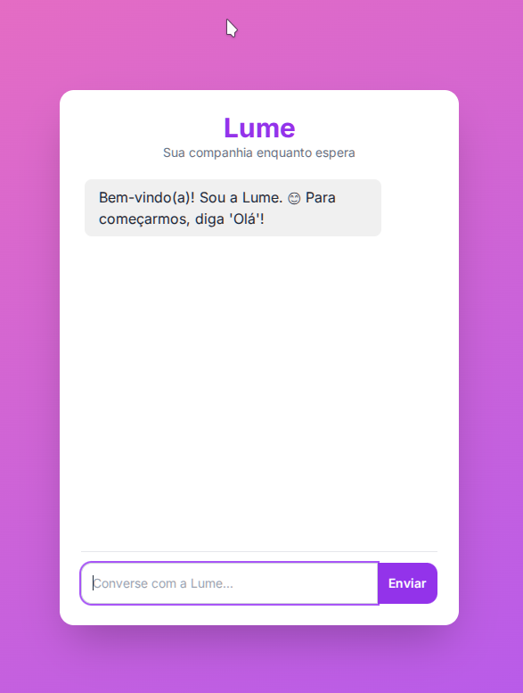

# CuidarBot - Recepção Inteligente para Postos de Saúde


## 📝 Descrição do Projeto

O **CuidarBot** é um sistema de recepção inteligente criado durante a **Imersão IA Alura+Google**, com o propósito de tornar o atendimento em postos de saúde mais humano, eficiente e organizado. Utiliza OCR e IA (Google Gemini) para ler dados de documentos, validar e gerar senhas automáticas de forma categorizada.

Além disso, possui integração com a **Lume**, uma agente virtual que acolhe e entretém os pacientes durante a espera com apoio de múltiplos agentes (relaxamento, motivação, curiosidades, dicas de saúde etc.).

## ✨ Funcionalidades Atuais

- Chatbot com IA Google Gemini
- Captura e leitura de CNH/RG via OCR (Nome, CPF, Data de Nascimento)
- Cálculo de idade automático
- Geração de senhas categorizadas com reinício diário
- Validação de dados (OCR + input manual)
- Restrição de uma senha por CPF/dia
- Banco de dados SQLite
- Interface Web com Flask + modo quiosque
- Painel administrativo com autenticação básica
- Exibição de QR Code para abrir o chat da Lume

## 🚀 Tecnologias Utilizadas

- Python 3.9+
- Flask
- Tesseract OCR, Pytesseract, OpenCV, Pillow
- Google Gemini API
- SQLite
- Tailwind CSS + JS (`qrcode.min.js`)
- Git + GitHub

## 📸 Telas do Sistema

- Chatbot do CuidarBot 
- Chatbot Lume .
- Painel Administrativo 

## ⚙️ Como Executar Localmente

```bash
sudo apt install tesseract-ocr tesseract-ocr-por libopencv-dev python3-opencv
git clone https://github.com/adelsontec/recepcao_inteligente.git
cd recepcao_inteligente
python3 -m venv venv
source venv/bin/activate
pip install -r requirements.txt
```

Crie um arquivo `.env` com:

```env
GOOGLE_API_KEY="SUA_CHAVE_API_GEMINI_AQUI"
FLASK_APP=run.py
FLASK_DEBUG=True
SECRET_KEY="CHAVE_SEGURA"
ADMIN_USERNAME="admin"
ADMIN_PASSWORD="senha"
LUME_PORT=5001
```

Depois:

```python
from app import db_utils
db_utils.init_db()
```

E execute:

```bash
flask run
```

## 🔮 Visão de Futuro — Lume, Acompanhante de Fila

A **Lume** é uma IA interativa criada com o Google ADK + Gemini, que conversa com o paciente durante a espera por meio de agentes:

- Relaxamento
- Espiritualidade / Motivação
- Curiosidades
- Dicas para pais e mães
- Bem-estar / saúde
- Sugestões de áudio/podcast
- Atividades mentais

O QR Code é gerado automaticamente ao final do atendimento no CuidarBot. O protótipo já está funcional e está na pasta `lume_acompanhante_adk/`.

## 💡 Melhorias Futuras

- Triagem automatizada com IA
- OCR com Google Vision
- Integração com e-SUS PEC
- Dashboards visuais (tempo de espera, categorias, etc.)
- Comandos por voz e reconhecimento facial local (com privacidade)
- Autenticação avançada, criptografia e LGPD
- Multi-plataforma: WhatsApp, Telegram
- API RESTful externa

## 👨‍💻 Autor

**Adelson Guimarães** — [github.com/adelsontec](https://github.com/adelsontec)

## 🙏 Agradecimentos

- A **DEUS**, pela inspiração e propósito
- À minha **esposa**, que plantou a ideia original
- À minha **família**, que me impulsiona com amor
- À **Imersão IA Alura + Google**, pela oportunidade
- A todos que acreditam que **tecnologia pode cuidar, incluir e transformar**

---

*Este README foi atualizado em 18 de Maio de 2025.*
